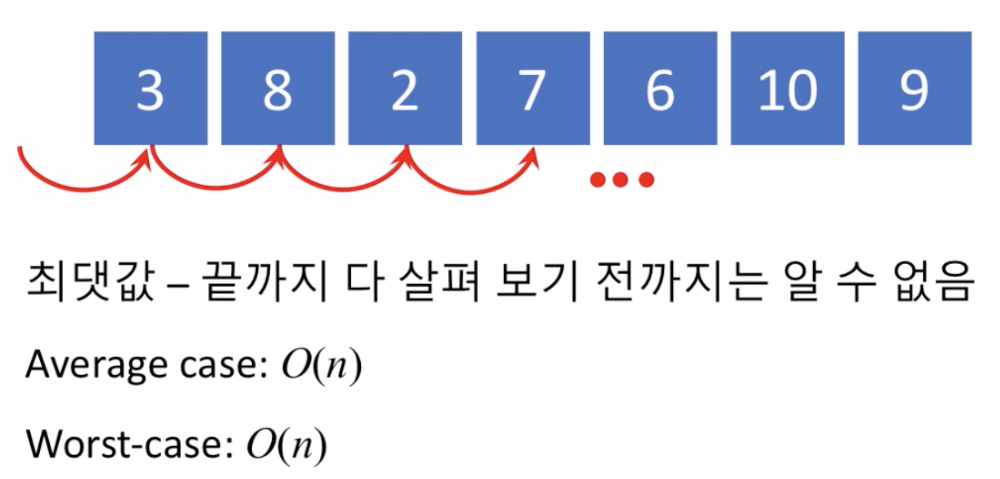
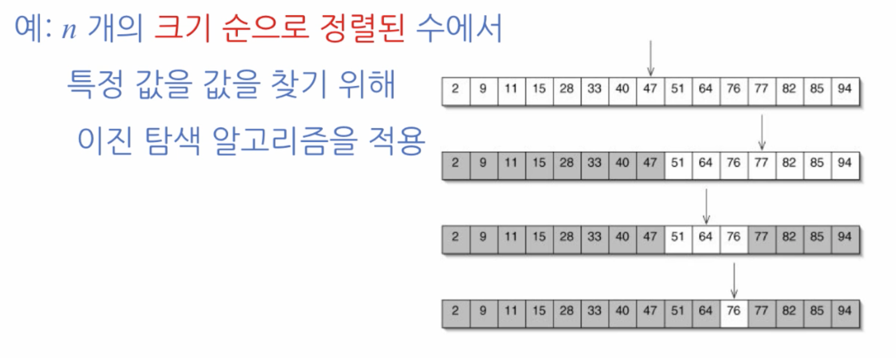
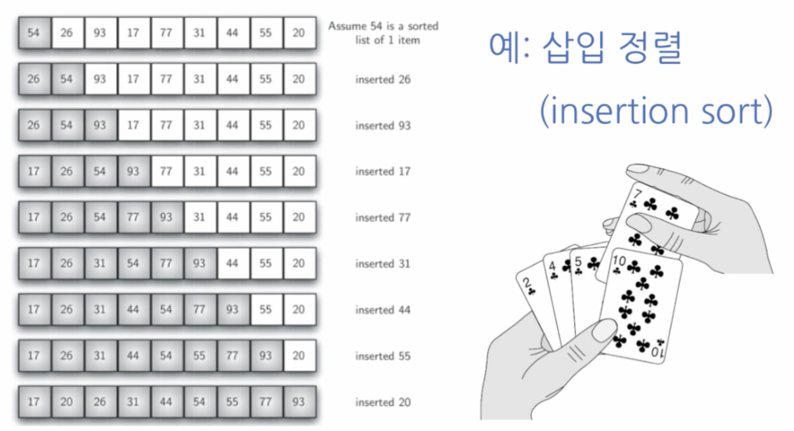
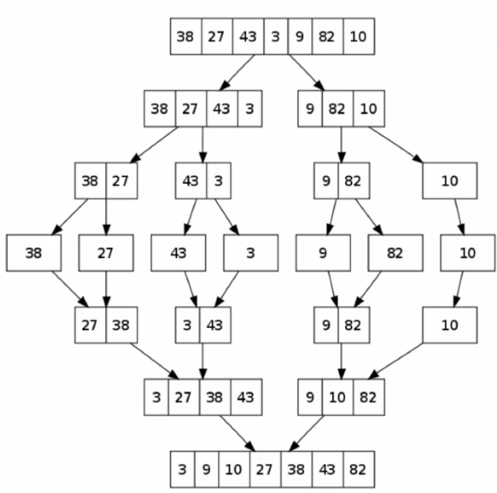
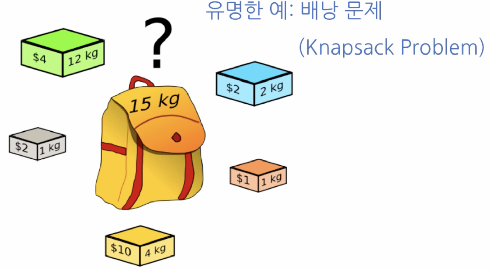

# 알고리즘의 복잡도 (Complexity of Algorithms)

- 시간 복잡도 (Time Complexity)

  > 문제의 크기와 이를 해결하는 데 걸리는 시간 사이의 관계

- 공간 복잡도 (Space Complexity)
  > 문제의 크기와 이를 해결하는 데 필요한 메모리 공간 사이의 관계

### 시간 복잡도

- 평균 시간 복잡도 (Average Time Complexity)
  > 임의의 입력 패턴을 가정했을 때 소요되는 시간의 평균
- 최악 시간 복잡도 (Worst-case Time Complexity)
  > 가장 긴 시간을 소요하게 만드는 입력에 따라 소요되는 시간

#### Big-O Notation

- 점근 표기법 (asymptotic notation)의 하나
- 어떤 함수의 증가 양상을 다른 함수와의 비교로 표현 (알고리즘의 복잡도를 표현할 때 흔히 쓰임)
- 입력의 크기가 n 일때,
  > - O(logn) - 입력의 크기의 로그에 비례하는 시간 소요
  > - O(n) - 입력의 크기에 비례하는 시간 소요
      - 입력의 크기가 커짐에 따라서 얼마나 실행 시간이 증가하는가의 관계를 표현
      - 계수는 크게 중요하지 않음
  > - 등등등...

##### 선형 시간 알고리즘 - O(n)

- 예: n 개의 무작위로 나열된 수에서 최댓값을 찾기 위해 선형 탐색 알고리즘을 적용

> 최댓값 - 끝까지 다 살펴보기 전까지는 알수 없음 (sort 안되어있음)
>
> - Average case: O(n)
> - Worst case: O(n)

##### 로그 시간 알고리즘 - O(logn)

- 예: n 개의 **크기 순으로 정렬된** 수에서 특정 값을 찾기 위해 이진 탐색 알고리즘을 적용

##### 이차 시간 알고리즘 - O(n제곱)

- 예: 삽입 정렬(insertion sort)

> 기준 값과 비교하며 삽입하며 정렬
>
> - Best case: O(n)
> - Worst case: O(n제곱) - 정확히는 n제곱 / 2 인데 bigO notation 에서는 상수는 제외

##### 병합 정렬 (merge sort) - O(nlogn) - 보다 나은(낮은) 복잡도를 가지는 정렬 알고리즘

> 참고: 입력 패턴에 따라 정렬 속도에 차이가 있지만, 정렬 문제에 대해 O(nlogn) 보다 낮은 복잡도를 갖는 알고리즘은 존재할 수 없음이 증명되어 있음
>
> - Divide & Conquer
> - 정렬할 데이터를 반씩 나누어 각각을 정렬시킨다 → O(logn)
>   정렬된 데이터를 두 묶음씩 한데 합친다 (하나의 묶음은 이미 정렬되어있음) → O(n)
>   → O(nlogn)

##### 배낭 문제(Knapsack Problem) (조금 복잡한 문제)

- 배낭의 크기에 맞게 어떤 아이템을 넣어야 최대의 가치를 얻어내는가?

  > - 아주 단순하게 모든 상자들을 넣고 안넣고를 계산하면, O(2의n승)
  > - Dynamic Programming 을 이용하면 더 효율적

- N 개의 원소로 이루어진 배열이 있습니다. 이 배열을 반씩 나누어 각각 정렬한 뒤 병합 (merge) 하는 방법을 통해서, 소위 divide-and-conquer 방법으로 정렬할 수 있습니다. 이러한 방법으로 데이터를 정렬하는 알고리즘을 병합 정렬 (merge sort) 알고리즘이라고 부릅니다. 병합 정렬 알고리즘의 복잡도
  > - O(NlogN)
- 이미 크기 순으로 정렬되어 있는 N 개의 원소를 가지는 배열로부터, 입력으로 주어진 데이터가 배열 내에 존재하는지, 또한 존재한다면 몇 번째 원소인지를 탐색하는 방법으로서, 배열의 가운데 원소와 입력 데이터를 비교하고 그 데이터와 같은 원소가 존재할 수 없는 절반의 배열을 버리는 방식을 택할 수 있습니다. 이러한 탐색 방법을 이진 탐색 (binary search) 이라고 부릅니다. 이진 탐색 알고리즘의 복잡도
  > - O(logN)
- N 개의 원소가 무작위 순서로 늘어서 있는 배열 내에, 입력으로 주어진 데이터가 존재하는지, 그리고 존재한다면 몇 번째 위치에 존재하는지를 알아내기 위하여 배열을 처음부터 시작해서 원소를 하나씩 입력 데이터와 비교하는 방법을 적용할 수 있습니다. 이러한 탐색 방법을 선형 탐색 (linear search) 이라고 부릅니다. 선형 탐색 알고리즘의 복잡도
  > - O(N)
- N 개의 수가 입력으로 주어진다고 할 때, 모든 원소들 사이의 대소 관계를 비교하여 N X N 행렬로 나타내고자 합니다. 이 문제를 풀기 위하여 모든 원소의 쌍에 대하여 대소 관계를 비교하여 그것을 행렬에 채우는 방법
  > - O(N제곱)
- N 행 N 열의 정사각행렬 A 와 B 가 주어진다고 할 때, 이 두 행렬의 곱 (product) 인 N X N 행렬 C 를 계산하기 위하여 다음과 같은 방법을 쓸 수 있습니다.

      ~~~python
      for i in range(N):
          for j in range(N):
              C[i][j] = 0
              for k in range(N):
                  C[i][j] += A[i][k] * B[k][j]
      ~~~

      이러한 알고리즘을 이용하여 행렬의 곱셈을 행할 때, 이 행렬 곱셈 (matrix multiplicaiton) 알고리즘 복잡도

  > - O(N세제곱)
