# 재귀 알고리즘

- 하나의 함수에서 자신을 다시 호출하여 작업을 수행하는 것 (많은 부분들이 재귀로 해결 가능)

  - ex) 이진트리

    - 왼쪽 서브트리의 원소들은 모두 작거나 같고, 오른쪽 서브트리의 원소들은 클것
    - 이 원칙을 모든 노드에 대해서 적용
      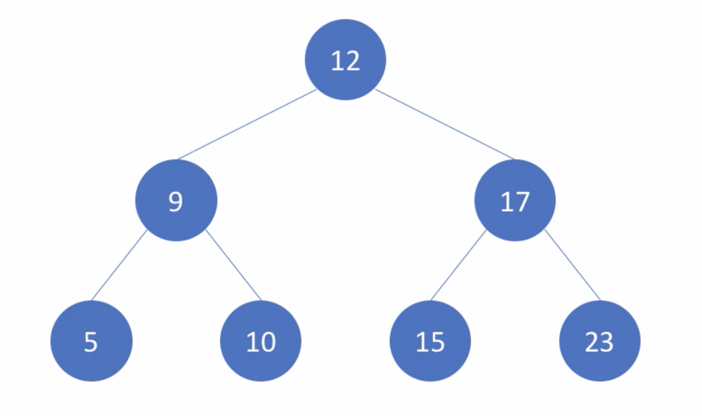

    - 트리 탐색: 10을 찾으시오!
      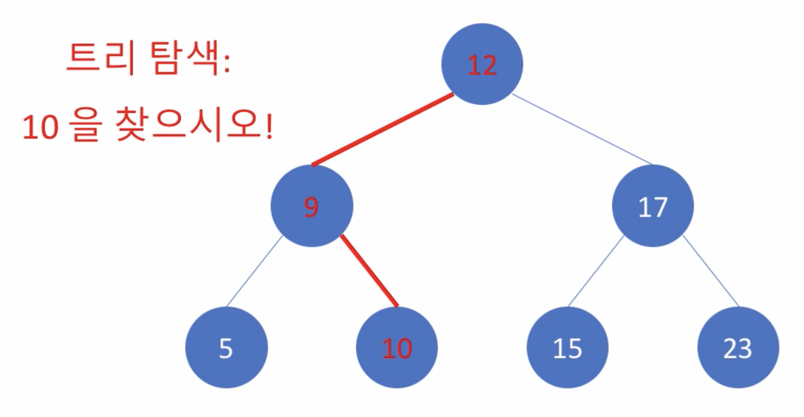

    - 보다 간단한 예 - 자연수의 합 구하기

      - 1부터 n까지 모든 자연수의 합을 구하시오

        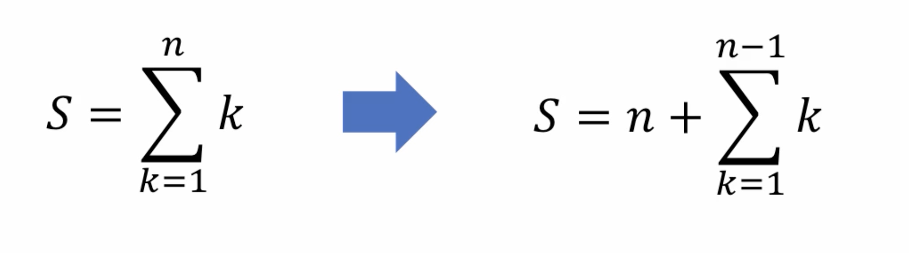

        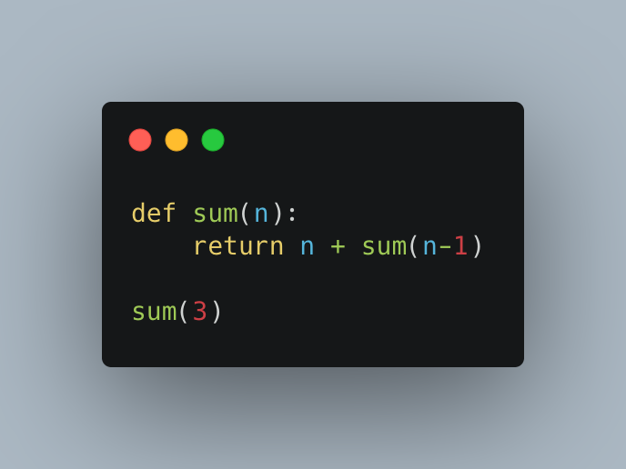

        결과 → RuntimeError: maximum recursion depth exceeded 에러

      - 종결 조건 추가

        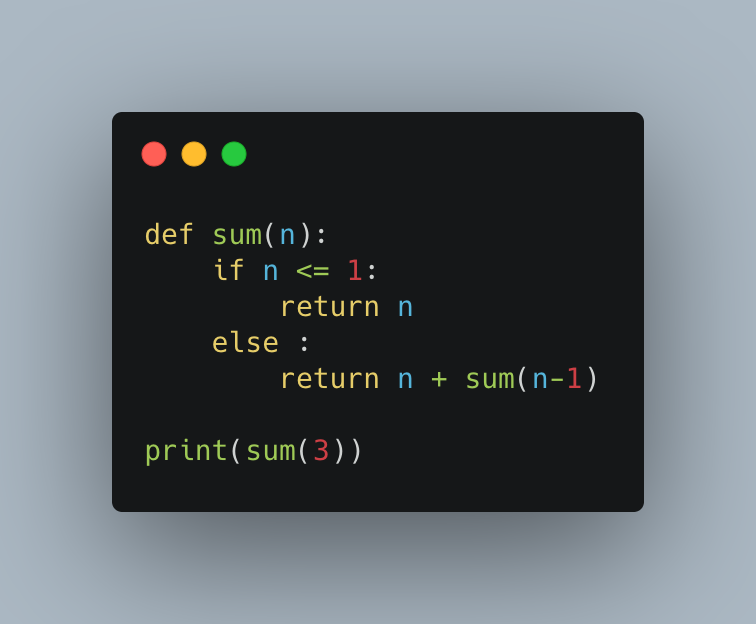

        결과 → 6

    - **재귀 호출의 종결조건이 정말 중요**
      - 인자로 주어진 값에 대해 분기 처리 필수
    - 재귀 알고리즘의 효율

      Recursive vs Iterative

      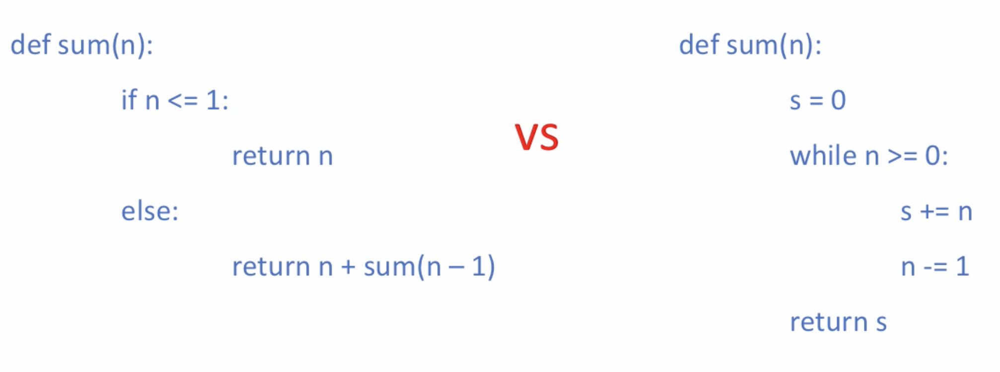

      - **복잡도**는 n이 커지면 O(n) vs O(n)
      - 재귀함수는 사람이 생각하는 방식으로 구현하는데에 적합할 수도 있으나, **효율성** 측면에서는 재귀함수는 n 이 커지면서 함수를 호출하는데에 드는 비용이나 여러가지 측면에서 효율적인 부분에 대해 조심해야 할 부분이 있음

    - 재귀 알고리즘 추가 예제

      Factorial - n!

      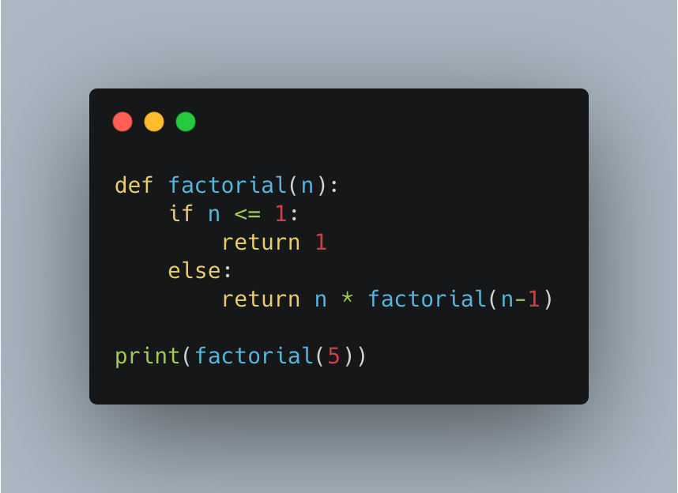

    - 피보나치 순열을 recursive, iterative 둘다 작성

      Recursive version

      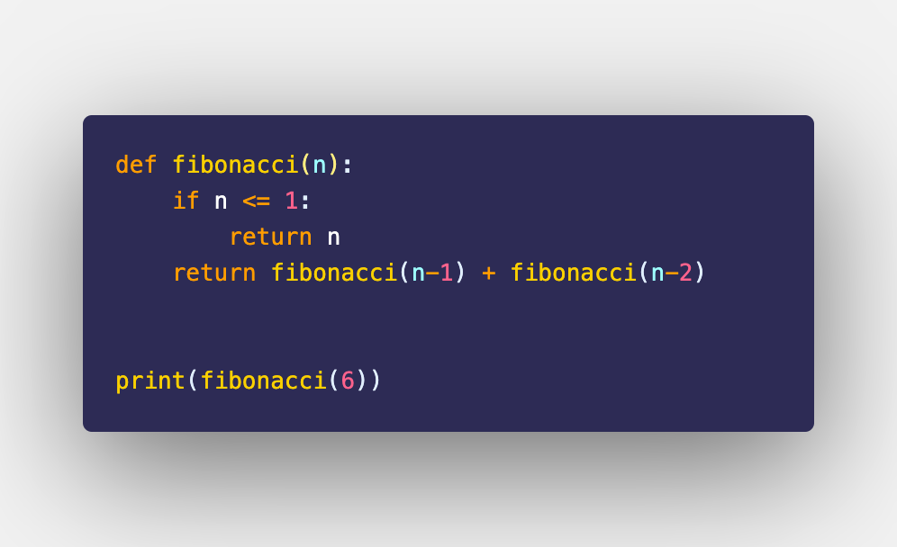

      Iterative version

      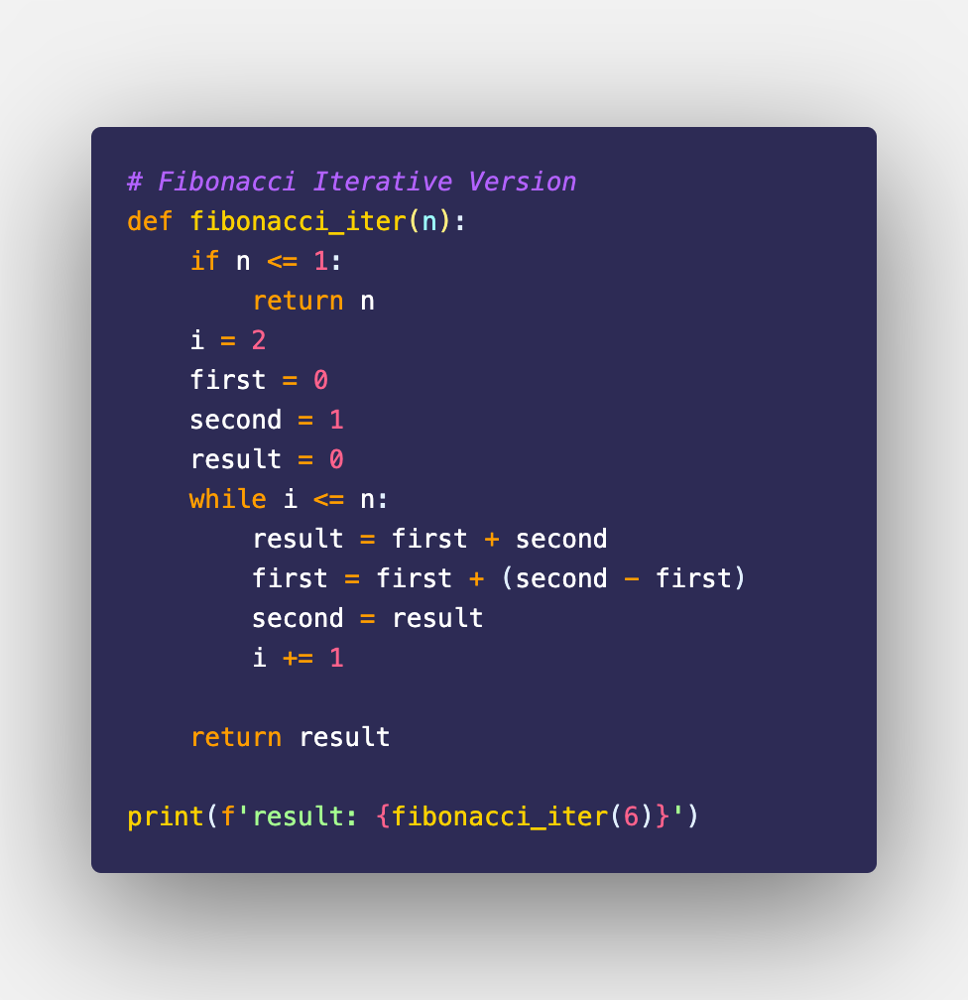

# 재귀 알고리즘 응용

### 조합의 수 계산

- n개의 서로 다른 원소에서 m개를 택하는 경우의 수
  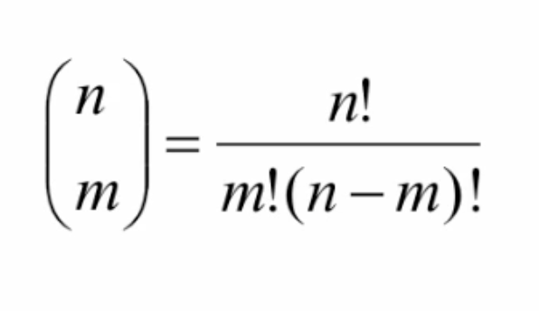
  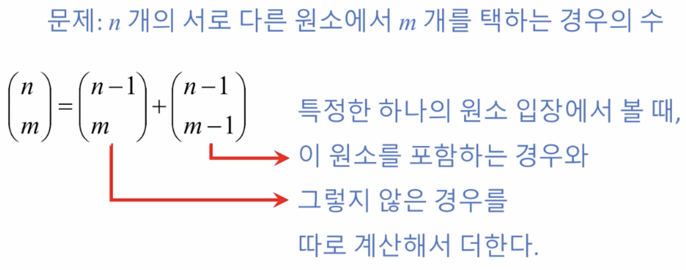

### 재귀적 이진 탐색 구현

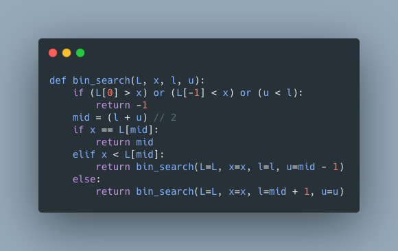
