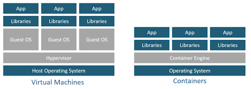

# Docker

Docker 는 리눅스 컨테이너에 여러 기능을 추가함으로써 애플리케이션을 컨테니어로서 좀 더 쉽게 사용할 수 있게 만들어진 오픈소스 프로젝트.

### 가상 머신 vs 도커 컨테이너

|      | 가상 머신                                                                                                         | 도커 컨테이너                                                                                                                                         |
| ---- | ----------------------------------------------------------------------------------------------------------------- | ----------------------------------------------------------------------------------------------------------------------------------------------------- |
| 구성 | Hypervisor 위에 GuestOS                                                                                           | Docker Engine 위에 Container                                                                                                                          |
| 장점 | 완벽한 운영체제를 생성 할 수 있다                                                                                 | 컨테이너를 이미지로 만들어 배포하는 시간이 가상머신에 비해 빠름, \*가상화된 공간 사용시 성능 손실 거의 없음, 가상 머신 이미지에 비해 작은 이미지 용량 |
| 단점 | \*일반 호스트에 비해 성능 손실이 있음, 수 기가 바이트의 가상 머신 이미지를 애플리케이션으로 배포하기는 부담스러움 | 이미지 작성 방법 습득                                                                                                                                 |

- **\*가상화된 공간 사용시 성능 손실 거의 없는 이유**: 도커 컨테이너는 가상화된 공간을 생성하기 위해 리눅스의 자체 기능인 chroot, 네임스페이스 , cgroup을 사용함으로써 프로세스 단위의 격리 환경을 만들기 때문에.
- **\*성능 손실 생기는 이유**: 각종 시스템 자원을 가상화하고 독립된 공간을 생성하는 작업은 하이퍼바이저를 반드시 거치기 때문에 일반 호스트에 비해 성능 손실 발생.
- **\*가상 머신 이미지에 비해 이미지 용량이 작은 이유**: 컨테이너에 필요한 커널은 호스트의 커널을 공유해 사용하고, 컨테이너 안에는 애플리케이션을 구동하는 데 필요한 라이브러리 및 실행파일만 존재하기 때문에.
