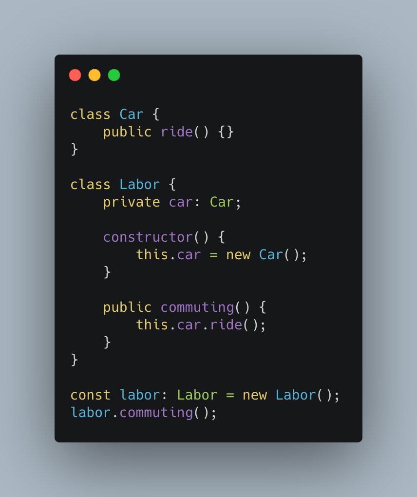
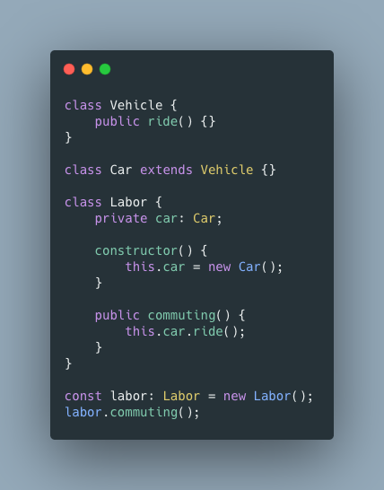
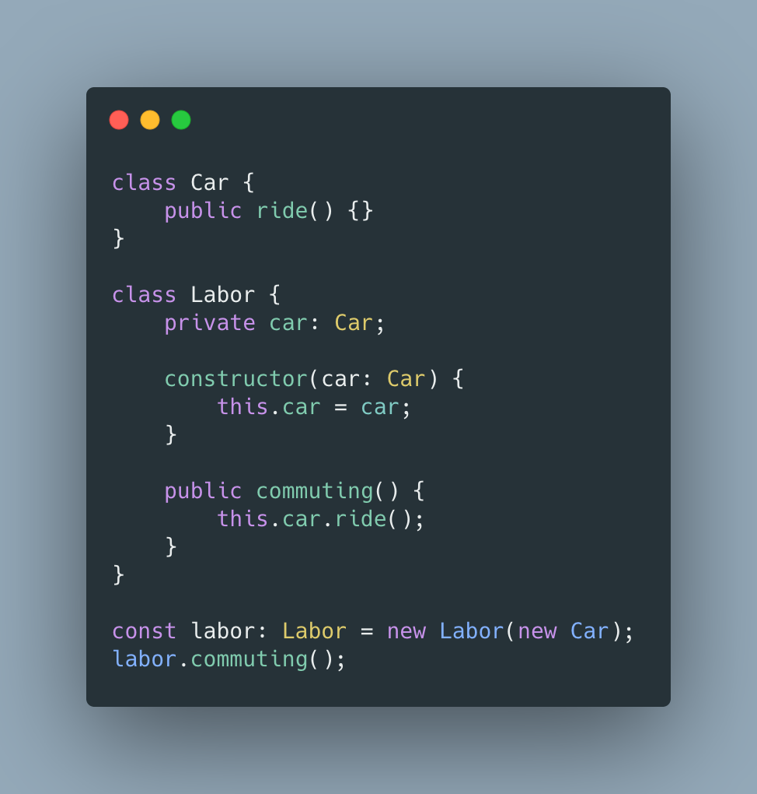
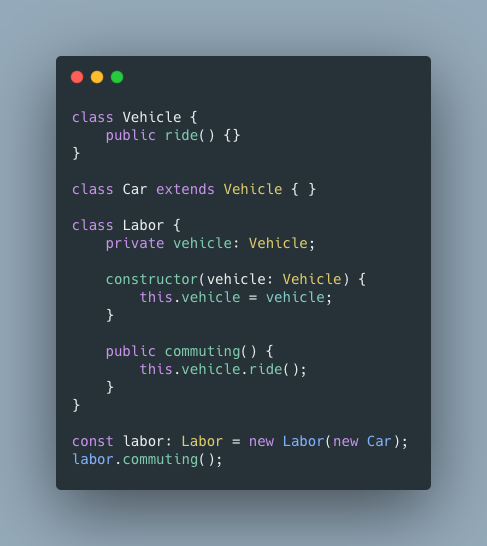

# 의존성 주입

### 의존성

- **의존성**은 구성 요소들이 서로 의존하는 성질
  

> Labor 클래스는 Vehicle 클래스에 의존성을 띔.

### 대표적인 문제

- 구성요소가 의존성을 띄게되면 변경에 민감해짐.
- 위의 예제에서 Labor가 일반적인 Vehicle가 아닌 Car를 타고 출근하도록 변경하고 싶음.
  

- Vehicle 클래스를 상속받는 Car 클래스를 생성했습니다. Labor 클래스가 Vehicle 클래스에 의존하고 있었기 때문에 Labor 클래스를 직접 수정해야 했음.

> 이렇게 *의존성*은 *하나를 변경*하면 그것에 *의존하는 다른 것들도 모두 변경*하도록 만듬
> 그러나 **의존성 주입**을 통해서 해당 문제를 해결할 수 있음

### 의존성 주입

- 의존성 주입이란 말그대로 외부에서 의존성을 주입해주는 것을 말함.
  

- 처음의 예제에서 **의존성 주입**을 사용해 봄. Labor 클래스가 의존하던 Vehicle 클래스의 객체를 외부에서 주입해주고 있음

- 이번에는 Labor가 Car를 타게 하고 싶음.
  

- 아까 문제가 생겼던 예제와 차이가 있음. Vehicle 클래스의 객체 대신 Car 클래스의 객체를 주입해주면 Labor 클래스를 수정하지 않고도 매우 편리하게 변경사항 적용 가능. 이것이 **의존성 주입**을 사용하는 이유

> 그러나 의존성 주입만 사용하는 것도 문제를 만듬. 그래서 우리는 **의존 관계 역전의 원칙(Dependency Inversion Principle, DIP)**을 공부해 볼 차례.
