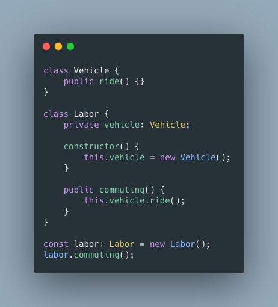
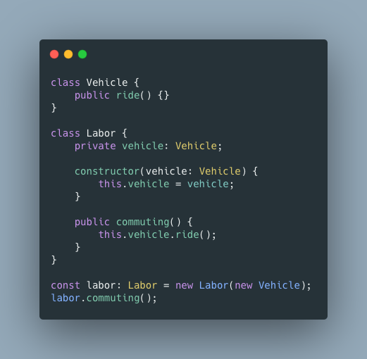

# 의존성 주입

### 의존성

- **의존성**은 구성 요소들이 서로 의존하는 성질

> Labor 클래스는 Vehicle 클래스에 의존성을 띔.

### 대표적인 문제

- 구성요소가 의존성을 띄게되면 변경에 민감해짐.
- 위의 예제에서 Labor가 일반적인 Vehicle가 아닌 Car를 타고 출근하도록 변경하고 싶음.

- Vehicle 클래스를 상속받는 Car 클래스를 생성했습니다. Labor 클래스가 Vehicle 클래스에 의존하고 있었기 때문에 Labor 클래스를 직접 수정해야 했음.

> 이렇게 *의존성*은 *하나를 변경*하면 그것에 *의존하는 다른 것들도 모두 변경*하도록 만듬
> 그러나 **의존성 주입**을 통해서 해당 문제를 해결할 수 있음

### 의존성 주입

- 의존성 주입이란 말그대로 외부에서 의존성을 주입해주는 것을 말함.

- 처음의 예제에서 **의존성 주입**을 사용해 봄. Labor 클래스가 의존하던 Vehicle 클래스의 객체를 외부에서 주입해주고 있음

- 이번에는 Labor가 Car를 타게 하고 싶음.

- 아까 문제가 생겼던 예제와 차이가 있음. Vehicle 클래스의 객체 대신 Car 클래스의 객체를 주입해주면 Labor 클래스를 수정하지 않고도 매우 편리하게 변경사항 적용 가능. 이것이 **의존성 주입**을 사용하는 이유

> 그러나 의존성 주입만 사용하는 것도 문제를 만듬. 그래서 우리는 의존 관계 역전의 원칙(Dependency Inversion Principle, DIP) 을 공부해 볼 차례.

### 의존 관계 역전의 원칙

- **의존 관계 역전의 원칙**이란 SOLID 원칙 중 하나로, 변화하기 쉬운 것 보단 변화히기 어려운 것에 의존하라는 원칙
- 예를 들면 근로자들이 출퇴근을 할때 뭘 타고 출근하는지는 바뀔 수 있음.(ex: 자동차, 버스, 기차, 지하철, 택시 등등등)
- 그러나 근로자들이 이동수단을 타고 출퇴근을 한다는 점은 변하기가 쉽지 않음.

Car 클래스와 Bus 클래스가 Vehicle 인터페이스를 구현하고 있음. 그리고 Labor 클래스의 생성자는 Vehicle 타입의 인자를 받고 있음.

따라서 모든 클래스가 Vehicle 이라는 인터페이스에 의존하게 되고, 이는 일반적인 의존 관계(하위 클래스가 상위클래스에 의존)와는 다르다는 것을 알 수 있음.

이제 여기서 Subway, Train, Bike 등등 다른 이동수단을 이용하고 싶다면 Vehicle 인터페이스를 구현하는 해당 이동수단 클래스를 만들면 됨

즉, 이러한 의존 관계는 **유연한 확장**이 가능하게 만들고, **변경이 불필요**하도록 만듬. 이는 SOLID 원칙 중 **개방-폐쇄 원칙**이 지켜진 것

여기서 더 나아가서 **제어권의 역전**에 대해 알아 볼것

### 제어권의 역전

- 의존성 주입만 사용하게 되면 개발자가 **직접 의존성을 관리**해야 함. 하지만 **클래스가 가질 수 있는 의존성은 무한**함. 따라서 새로운 객체를 생성할 떄 마다 직접 주입해 주는 것은 **지루하고 비효율적**임

그래서 typescript 의 경우 typedi 라는 의존성 주입 도구를 사용함.

인스턴스화가 필요한 클래스에 Service 데코레이터를 붙여주고, 필요한 의존성은 클래스 내부에 선언해주면 typedi가 **알아서 의존성을 주입함**

우리는 직접 의존성의 인스턴스를 생성하지 않아도 됨. typedi 에게 의존성 정보를 알려주고(constructor에 선언) 필요할 때 요구(Container.get) 하면 됨.

> @Service() 데코레이터를 붙인 클래스의 같은 인스턴스를 사용하기 위해서는 Container.get("클래스명") 으로 호출하면 된다.

즉, 우리가 아니라 **typedi가 제어권을 갖는 주체**로 동작함. 이를 **제어권의 역전(Inversion of Control, IoC)**

